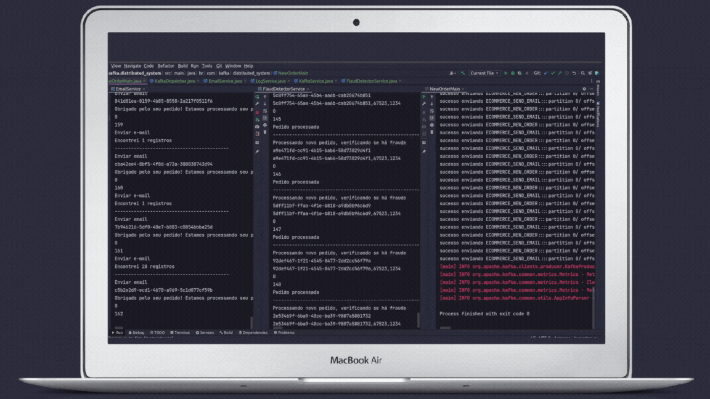

<h1 align="center">Project Kafka Distributed System</h1>

## 💻 Descrição

Aplicação simula a verificação de fraudes quando e efetuado uma compra, demostra de forma simple e simplificada como pode ser feito utilizando o kafka nesta situação.

## 🧪 Tecnologias utilizadas

Ferramentas necessarias para exercutar o projeto

- Docker
- Java (JDK 11)
- Kafka
- Mavem
- IDE (vs code)
- Git

## ⚙ Projeto

Clone o repositório do projeto

```
git clone https://github.com/erikbernard/kafka-distributed-system.git
```

Acesse a pasta do projeto

```
cd ./kafka-distributed-system
```

Certifique que as dependências do file pom.xml estão instaladas.

## Execução do kafka com docker-compose

acesse a pasta do src e digite o comando

```
cd ./src

docker-compose up
```

Verifique se kafdrop está funcionando

```
http://localhost:9000/
```

Com o kafdrop podemos visualizar informações de brokers Kafka como tópicos existentes, os consumers, as mensagens enviadas a um tópico, como também criar partições.

<p align="center">
    <apan align="center">
      
    </span>
</p>

## Executando o Producer

acesse a class "NewOrderMain" execute a main.

## Executando os Comsumes

Abrar um novo terminal para cada consumer em execução.

- acesse a class "EmailService" execute a main.
- acesse a class "FlaudDetectorService" execute a main.

No terminal aparecerá as messagem enviadas para cada um dos topicos.

## Projeto em execução

<p align="center">
    <apan align="center">
      
    </span>
</p>
